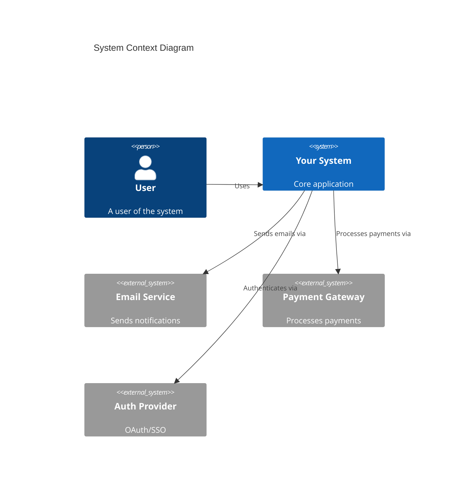
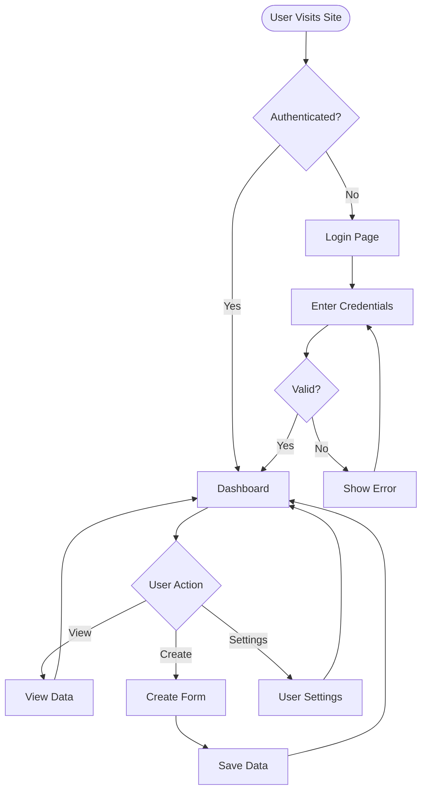
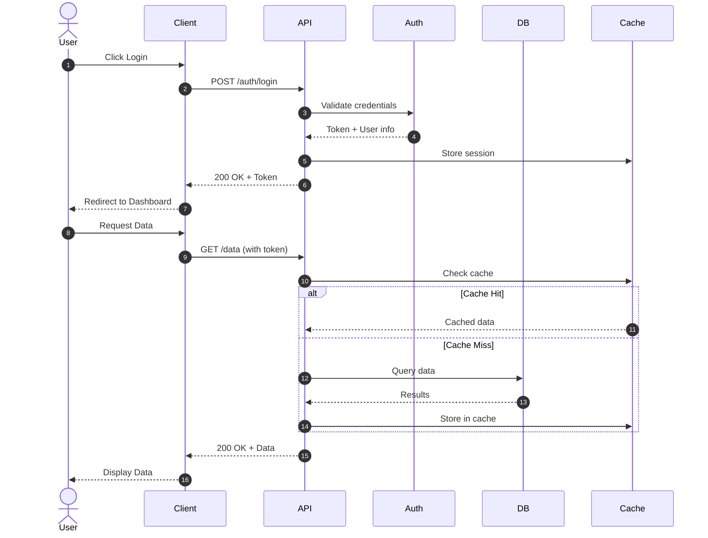
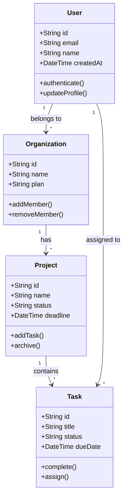
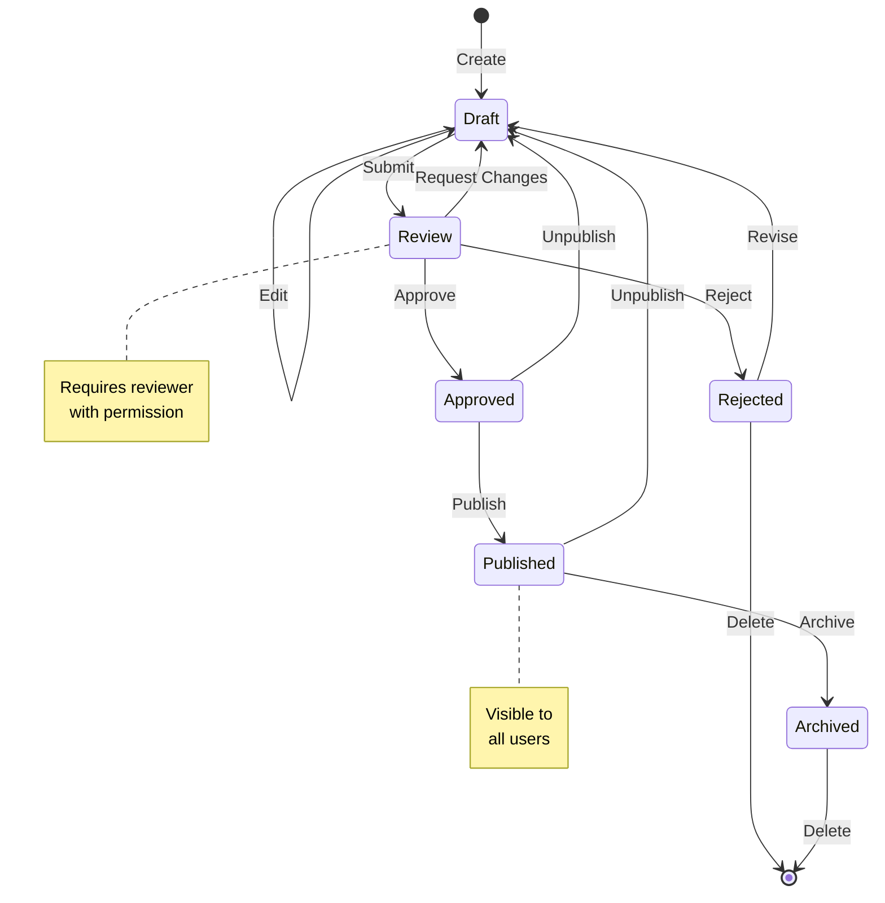
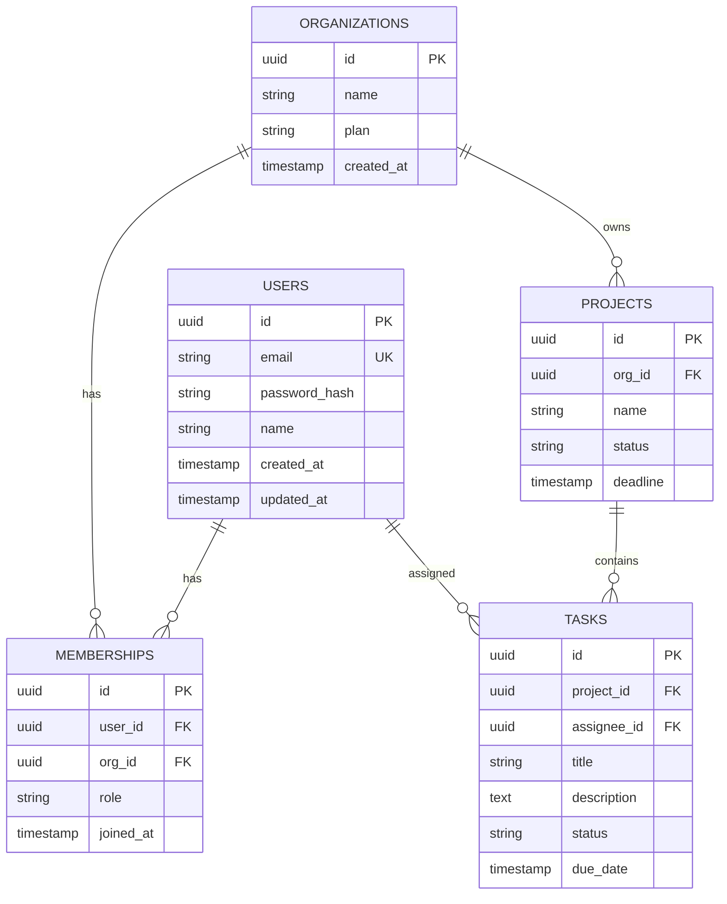
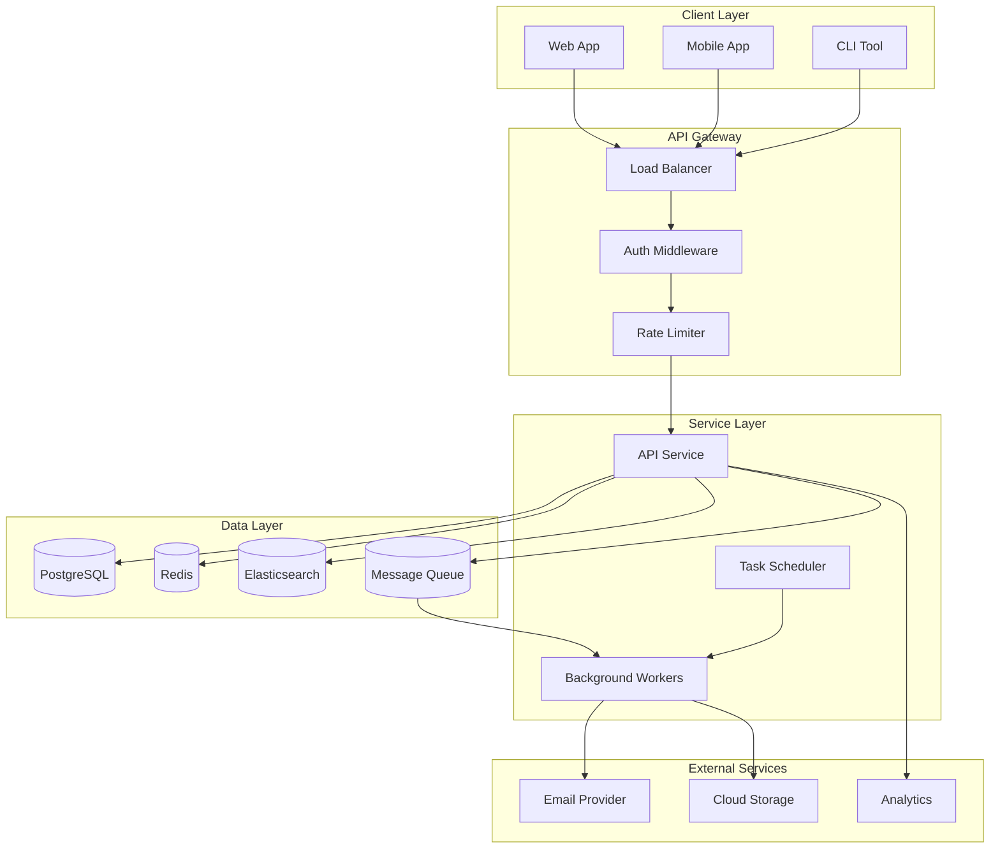
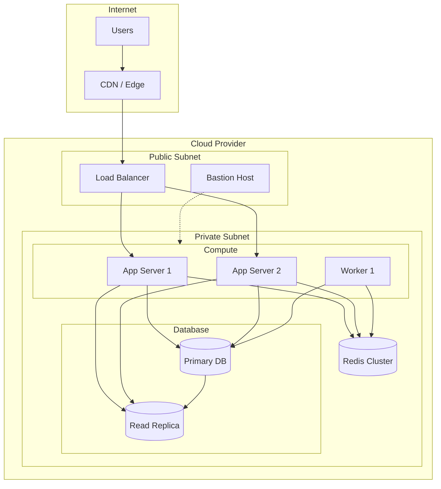

# Architecture Diagrams

This guide provides Mermaid diagram templates for documenting your architecture.

> **Tip:** GitHub renders Mermaid diagrams automatically. Most AI assistants can also generate and modify these diagrams.

## Quick Reference

| Diagram Type | Best For |
|--------------|----------|
| Flowchart | User flows, process flows, decision trees |
| Sequence | API interactions, service communication |
| Class | Data models, entity relationships |
| State | Status workflows, lifecycle management |
| ER | Database schemas |
| C4 Context | High-level system overview |

---

## System Context (C4 Model)

Shows your system and how it interacts with users and external systems.



---

## Flowchart - User Journey

Shows how users navigate through your application.



---

## Sequence Diagram - API Flow

Shows how services communicate for a specific operation.



---

## Class Diagram - Data Models

Shows your domain entities and their relationships.



---

## State Diagram - Status Workflow

Shows the lifecycle states of an entity.



---

## Entity Relationship - Database Schema

Shows database tables and their relationships.



---

## Architecture Overview

Shows the high-level system architecture.



---

## Deployment Architecture

Shows how your system is deployed.



---

## Usage Tips

### In Your Documentation

1. **Create focused diagrams** - One concept per diagram
2. **Keep them updated** - Outdated diagrams are worse than none
3. **Add context** - Include a brief description above each diagram
4. **Link to code** - Reference relevant files or modules

### With AI Assistants

```
"Generate a sequence diagram showing the checkout flow"
"Update this ER diagram to add a comments table"
"Create a state diagram for order status"
```

### Best Practices

- Use consistent naming across diagrams
- Color-code by type (services, databases, external)
- Include a legend for complex diagrams
- Version control your diagrams with your code

---

## Resources

- [Mermaid Documentation](https://mermaid.js.org/intro/)
- [Mermaid Live Editor](https://mermaid.live/)
- [C4 Model](https://c4model.com/)
- [GitHub Mermaid Support](https://github.blog/2022-02-14-include-diagrams-markdown-files-mermaid/)
